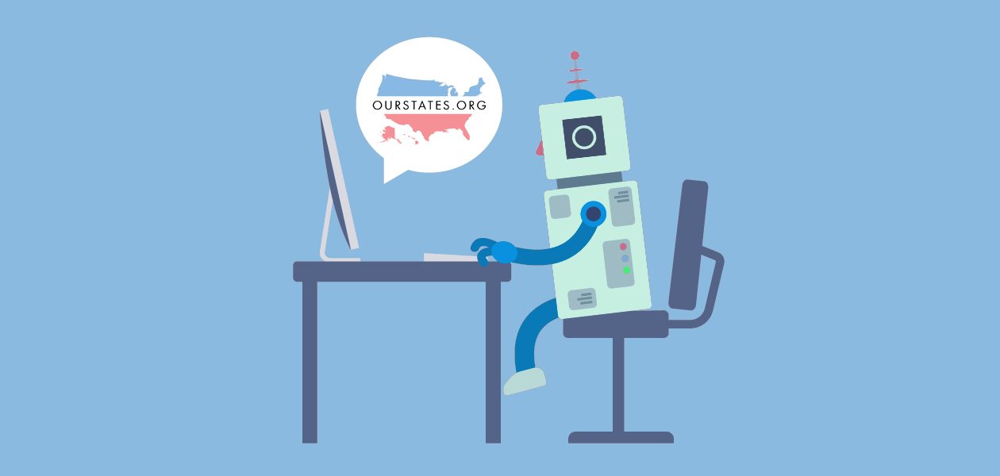

OurStates Chat Bot
===

  

#### NOTE: This Project is Not Currently Functional

Developer Overview
---

1. [Downloading Chat Bot](docs/downloading-chat-bot.md)
2. [Getting Setup with Docker ( Recommended )](docs/getting-setup-with-docker.md)
3. [Development Scripts](docs/development-scripts.md)
4. [Unit Testing and Code Coverage Reports](docs/unit-testing-and-code-coverage-reports.md)

#### Additional Setup without Docker

* [Getting Setup without Docker](docs/getting-setup-without-docker.md)
* [Redis Configuration](docs/redis-configuration.md)

#### Additional Information

* [BotMan Documentation](https://botman.io)
* [Troubleshooting](docs/troubleshooting.md)
